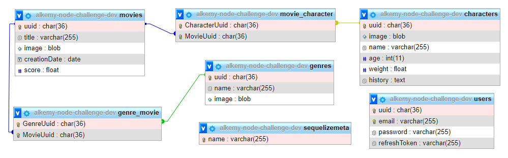

# alkemy-node-challenge

Una _API_ para explorar el mundo de _Disney_, la cual permite conocer y modificar los personajes que lo componen y entender en que películas estos participaron. También expone la información para que cualquier _frontend_ pueda consumirla

## Prerequisitos

### Variables de Entorno

Se necesitará un archivo `.env` en la raiz del proyecto con las siguientes variables:

- `SERVER_PORT` : Puerto que escuchará nuestro servidor
- `DATABASE_USERNAME` : Usuario de la base de datos
- `DATABASE_PASSWORD` : Contraseña del usuario de la base de datos
- `DATABASE_NAME` : Nombre de la base de datos
- `DATABASE_HOST` : Host donde reside la base de datos
- `JWT_ACCESS_SECRET` : Clave secreta para firmar los token de acceso
- `JWT_REFRESH_SECRET` : Clave secreta para firmar los token de actualización
- `SENDGRID_API_KEY` : Clave para mandar mails por SendGrid
- `SENDGRID_SENDER` : Email que figurará como emisor de los emails
- `NON_PRODUCTION_EMAIL_RECEIVER` : Email que recibirá los email de registro cuando no se corre en producción

## Requerimientos técnicos

- [Modelado de Base de Datos](#Modelado-de-Base-de-Datos) ✔️
- [Autenticación de Usuarios](#Autenticación-de-Usuarios) ✔️
- [Listado de Personajes](#Listado-de-Personajes) ✔️
- [CRUD Personajes](#CRUD-Personajes) ✔️
- [Detalles de Personaje](#Detalles-de-Personaje) ✔️
- [Búsqueda de Personaje](#Búsqueda-de-Personaje) ✔️
- [Listado de Películas](#Listado-de-Películas) ✔️
- [Detalles de Películas](#Detalles-de-Películas) ✔️
- [CRUD de Películas](#CRUD-de-Películas) ✔️
- [Búsqueda de Películas](#Búsqueda-de-Películas) ✔️
- [Envío de mails](#Envío-de-mails) ✔️
- [Documentación](#Documentación)
- [Test](#Test)

### Modelado de Base de Datos

- Personaje
  - Imagen
  - Nombre
  - Edad
  - Peso
  - Historia
  - Películas o Series asociadas
- Película o Serie
  - Imagen
  - Título
  - Fecha de creación
  - Calificación (del 1 al 5)
  - Personajes asociados
- Género
  - Nombre
  - Imagen
  - Películas o Series asociadas

Además se han agregado las tablas que manejan las relaciones M:N y la autorización del uso de la API.

<div align='center'>



</div>

### Autenticación de Usuarios

#### Registro de usuario

```http
POST /auth/register

{
  "email":"tu_email@email.com",
  "password":"tu_contraseña"
}
```

Validaciones:

- email:
  - Requerido
  - No puede ser vacío
  - Debe ser un email válido
  - Debe ser un email no registrado
- password:
  - Requerido
  - No puede ser vacío
  - Debe tener al menos 8 caracteres

Posibles respuestas:

- `201 Created`
- `400 Bad Request` : Error al validar los datos
  ```json
  {
    "errors": ["algunos_mensajes_de_error"]
  }
  ```
- `500 Internal Server Error`

---

#### Inicio de sesión

```http
POST /auth/login

{
  "email":"tu_email@email.com",
  "password":"tu_contraseña"
}
```

Validaciones:

- email:
  - Requerido
  - No puede ser vacío
  - Debe ser un email válido
  - Debe ser un email registrado
- password:
  - Requerido
  - No puede ser vacío
  - Debe ser la contraseña con la cual se registró

Posibles respuestas:

- `200 OK`

  ```http
  Set-Cookie: refreshToken=tu_token_de_actualización; Path=/auth/token; HttpOnly
  ```

  ```json
  {
    "accessToken": "tu_token_de_acceso"
  }
  ```

- `400 Bad Request` : Error al validar los datos
  ```json
  {
    "errors": ["algunos_mensajes_de_error"]
  }
  ```
- `500 Internal Server Error`

---

#### Obtención de un nuevo token

```http
POST /auth/token
Cookie: refreshToken=tu_token_de_actualización

{
  "email":"tu_email@email.com",
  "password":"tu_contraseña"
}
```

Posibles respuestas:

- `200 OK`

  ```http
  Set-Cookie: refreshToken=tu_nuevo_token_de_actualización; Path=/auth/token; HttpOnly
  ```

  ```json
  {
    "accessToken": "tu_nuevo_token_de_acceso"
  }
  ```

- `401 Unauthorized` : No posee la cookie necesaria
- `403 Forbidden` : La cookie es inválida
- `400 Bad Request` : Usuario inválido o la cookie es diferente a la asignada al usuario
- `500 Internal Server Error`

---

#### Cierre de sesión

```http
POST /auth/logout
```

Se eliminará de las cookies el token de actualización `refreshToken`

Posibles respuestas:

- `200 OK`

  ```http
  Set-Cookie: refreshToken=; Path=/auth/token; Expires=Thu, 01 Jan 1970 00:00:00 GMT
  ```

- `500 Internal Server Error`

### Listado de Personajes

```http
GET /characters
Authorization: Bearer tu_token_de_acceso
```

Posibles respuestas:

- `200 OK`

  ```json
  [
    {
      "image": "blob",
      "name": "nombre_del_personaje"
    }
    // ...
  ]
  ```

- `401 Unauthorized` : No se envió el token de acceso
- `403 Forbidden` : El token de acceso es inválido
- `500 Internal Server Error`

### CRUD Personajes

#### Creación

```http
POST /characters
Authorization: Bearer tu_token_de_acceso

{
  "image":"blob",
  "name":"nombre_del_personaje",
  "age":99,
  "weight":99.9,
  "history":"historia_del_personaje",
  "movies":[
    "uuid_de_una_pelicula",
    "uuid_de_otra_pelicula"
  ]
}
```

Validaciones:

- name:
  - Requerido
  - No puede ser vacío
- age:
  - Debe ser un número entero
- weight:
  - Debe ser un número real
- movies:
  - Debe ser un array
  - Debe contener UUID válidas
  - Las UUID deben estar asociadas a películas

Posibles respuestas:

- `201 Created`
- `401 Unauthorized` : No se envió el token de acceso
- `403 Forbidden` : El token de acceso es inválido
- `400 Bad Request` : Error al validar los datos
  ```json
  {
    "errors": ["algunos_mensajes_de_error"]
  }
  ```
- `500 Internal Server Error`

---

#### Edición

```http
PUT /characters
Authorization: Bearer tu_token_de_acceso

{
  "uuid":"uuid_de_un_personaje",
  "image":"blob",
  "name":"nombre_del_personaje",
  "age":99,
  "weight":99.9,
  "history":"historia_del_personaje",
  "movies":[
    "uuid_de_una_pelicula",
    "uuid_de_otra_pelicula"
  ]
}
```

Validaciones:

- uuid:
  - Requerido
  - Debe ser un UUID válido
  - El UUID debe estar asociado a un personaje
- name:
  - Requerido
  - No puede ser vacío
- age:
  - Debe ser un número entero
- weight:
  - Debe ser un número real
- movies:
  - Debe ser un array
  - Debe contener UUID válidas
  - Las UUID deben estar asociadas a películas

Posibles respuestas:

- `200 OK`
- `401 Unauthorized` : No se envió el token de acceso
- `403 Forbidden` : El token de acceso es inválido
- `404 Not Found` : No se encontró el personaje seleccionado
- `400 Bad Request` : Error al validar los datos
  ```json
  {
    "errors": ["algunos_mensajes_de_error"]
  }
  ```
- `500 Internal Server Error`

---

#### Borrado

```http
DELETE /characters
Authorization: Bearer tu_token_de_acceso

{
  "uuid":"uuid_de_un_personaje"
}
```

Validaciones:

- uuid:
  - Requerido
  - Debe ser un UUID válido
  - El UUID debe estar asociado a un personaje

Posibles respuestas:

- `200 OK`
- `401 Unauthorized` : No se envió el token de acceso
- `403 Forbidden` : El token de acceso es inválido
- `404 Not Found` : No se encontró el personaje seleccionado
- `400 Bad Request` : Error al validar los datos
  ```json
  {
    "errors": ["algunos_mensajes_de_error"]
  }
  ```
- `500 Internal Server Error`

### Detalles de Personaje

```http
GET /characters?query
Authorization: Bearer tu_token_de_acceso
```

**Query**

| Clave  | Descripción        |
| ------ | ------------------ |
| `uuid` | UUID del personaje |

Validaciones:

- uuid:
  - Debe ser un UUID válido

Posibles respuestas:

- `200 OK`

  ```json
  [
    {
      "uuid": "uuid_de_un_personaje",
      "image": "blob",
      "name": "nombre_de_un_personaje",
      "age": 99,
      "weight": 99.9,
      "history": "historia_de_un_personaje",
      "Movies": [
        {
          "uuid": "uuid_de_una_pelicula",
          "title": "titulo_de_una_pelicula",
          "image": "blob",
          "creationDate": "2021-10-30",
          "score": 5.0,
          "movie_character": {
            "CharacterUuid": "uuid_de_un_personaje",
            "MovieUuid": "uuid_de_una_pelicula"
          },
          "Genres": [
            {
              "uuid": "uuid_de_un_genero",
              "name": "nombre_de_un_genero",
              "image": "blob",
              "genre_movie": {
                "GenreUuid": "uuid_de_un_genero",
                "MovieUuid": "uuid_de_una_pelicula"
              }
            }
          ]
        }
      ]
    }
  ]
  ```

- `401 Unauthorized` : No se envió el token de acceso
- `403 Forbidden` : El token de acceso es inválido
- `500 Internal Server Error`

### Búsqueda de Personaje

```http
GET /characters?query
Authorization: Bearer tu_token_de_acceso
```

**Query**

| Clave    | Descripción                                    |
| -------- | ---------------------------------------------- |
| `name`   | Opcional. Nombre del personaje                 |
| `age`    | Opcional. Edad del personaje                   |
| `weight` | Opcional. Peso del personaje                   |
| `movie`  | Opcional. Películas donde aparece el personaje |

Validaciones:

- age:
  - Debe ser un número entero
- weight:
  - Debe ser un número real
- movies:
  - Debe ser un UUID válido

Posibles respuestas:

- `200 OK`

  ```json
  [
    {
      "uuid": "uuid_de_un_personaje",
      "image": "blob",
      "name": "nombre_de_un_personaje",
      "age": 99,
      "weight": 99.9,
      "history": "historia_de_un_personaje",
      "Movies": [
        {
          "uuid": "uuid_de_una_pelicula",
          "title": "titulo_de_una_pelicula",
          "image": "blob",
          "creationDate": "2021-10-30",
          "score": 5.0,
          "movie_character": {
            "CharacterUuid": "uuid_de_un_personaje",
            "MovieUuid": "uuid_de_una_pelicula"
          },
          "Genres": [
            {
              "uuid": "uuid_de_un_genero",
              "name": "nombre_de_un_genero",
              "image": "blob",
              "genre_movie": {
                "GenreUuid": "uuid_de_un_genero",
                "MovieUuid": "uuid_de_una_pelicula"
              }
            }
          ]
        }
      ]
    }
    //...
  ]
  ```

- `401 Unauthorized` : No se envió el token de acceso
- `403 Forbidden` : El token de acceso es inválido
- `500 Internal Server Error`

### Listado de Películas

```http
GET /movies
Authorization: Bearer tu_token_de_acceso
```

Posibles respuestas:

- `200 OK`

  ```json
  [
    {
      "image": "blob",
      "title": "nombre_de_una_pelicula",
      "creationDate": "fecha_de_creacion"
    }
    // ...
  ]
  ```

- `401 Unauthorized` : No se envió el token de acceso
- `403 Forbidden` : El token de acceso es inválido
- `500 Internal Server Error`

### Detalles de Películas

```http
GET /movies?query
Authorization: Bearer tu_token_de_acceso
```

**Query**

| Clave  | Descripción         |
| ------ | ------------------- |
| `uuid` | UUID de la película |

Validaciones:

- uuid:
  - Debe ser un UUID válido

Posibles respuestas:

- `200 OK`

  ```json
  [
    {
      "uuid": "uuid_de_una_pelicula",
      "title": "titulo_de_una_pelicula",
      "image": "blob",
      "creationDate": "2021-10-30",
      "score": 5.0,
      "Genres": [
        {
          "uuid": "uuid_de_un_genero",
          "name": "nombre_de_un_genero",
          "image": "blob",
          "genre_movie": {
            "GenreUuid": "uuid_de_un_genero",
            "MovieUuid": "uuid_de_una_pelicula"
          }
        }
      ],
      "Characters": [
        {
          "uuid": "uuid_de_un_personaje",
          "image": "blob",
          "name": "nombre_de_un_personaje",
          "age": 99,
          "weight": 99.9,
          "history": "historia_de_un_personaje",
          "movie_character": {
            "CharacterUuid": "uuid_de_un_personaje",
            "MovieUuid": "uuid_de_una_pelicula"
          }
        }
      ]
    }
  ]
  ```

- `401 Unauthorized` : No se envió el token de acceso
- `403 Forbidden` : El token de acceso es inválido
- `500 Internal Server Error`

### CRUD de Películas

#### Creación

```http
POST /movies
Authorization: Bearer tu_token_de_acceso

{
  "title":"nombre_de_una_pelicula",
  "image":"blob",
  "creationDate":"2021/10/30",
  "score":5.0,
  "genres":[
    "uuid_de_un_genero",
    "uuid_de_otro_genero"
  ]
}
```

Validaciones:

- title:
  - Requerido
  - No puede ser vacío
- creationDate:
  - Requerido
  - No puede ser vacío
  - Debe ser una fecha válida
  - Debe serguir el formato YYYY/MM/DD
- score:
  - Requerido
  - No puede ser vacío
  - Debe ser un número real
  - Debe ser mayor o igual que 1
  - Debe ser menor o igual que 5
- genres:
  - Debe ser un array
  - Debe contener UUID válidas
  - Las UUID deben estar asociadas a películas

Posibles respuestas:

- `201 Created`
- `401 Unauthorized` : No se envió el token de acceso
- `403 Forbidden` : El token de acceso es inválido
- `400 Bad Request` : Error al validar los datos
  ```json
  {
    "errors": ["algunos_mensajes_de_error"]
  }
  ```
- `500 Internal Server Error`

---

#### Edición

```http
PUT /movies
Authorization: Bearer tu_token_de_acceso

{
  "uuid":"uuid_de_una_pelicula",
  "title":"nombre_de_una_pelicula",
  "image":"blob",
  "creationDate":"2021/10/30",
  "score":5.0,
  "genres":[
    "uuid_de_un_genero",
    "uuid_de_otro_genero"
  ]
}
```

Validaciones:

- uuid:
  - Requerido
  - Debe ser un UUID válido
  - El UUID debe estar asociado a una película
- title:
  - Requerido
  - No puede ser vacío
- creationDate:
  - Requerido
  - No puede ser vacío
  - Debe ser una fecha válida
  - Debe serguir el formato YYYY/MM/DD
- score:
  - Requerido
  - No puede ser vacío
  - Debe ser un número real
  - Debe ser mayor o igual que 1
  - Debe ser menor o igual que 5
- genres:
  - Debe ser un array
  - Debe contener UUID válidas
  - Las UUID deben estar asociadas a películas

Posibles respuestas:

- `200 OK`
- `401 Unauthorized` : No se envió el token de acceso
- `403 Forbidden` : El token de acceso es inválido
- `404 Not Found` : No se encontró el personaje seleccionado
- `400 Bad Request` : Error al validar los datos
  ```json
  {
    "errors": ["algunos_mensajes_de_error"]
  }
  ```
- `500 Internal Server Error`

---

#### Borrado

```http
DELETE /movies
Authorization: Bearer tu_token_de_acceso

{
  "uuid":"uuid_de_una_pelicula"
}
```

Validaciones:

- uuid:
  - Requerido
  - Debe ser un UUID válido
  - El UUID debe estar asociado a una película

Posibles respuestas:

- `200 OK`
- `401 Unauthorized` : No se envió el token de acceso
- `403 Forbidden` : El token de acceso es inválido
- `404 Not Found` : No se encontró el personaje seleccionado
- `400 Bad Request` : Error al validar los datos
  ```json
  {
    "errors": ["algunos_mensajes_de_error"]
  }
  ```
- `500 Internal Server Error`

### Búsqueda de Películas

```http
GET /movies?query
Authorization: Bearer tu_token_de_acceso
```

**Query**

| Clave   | Descripción                     |
| ------- | ------------------------------- |
| `title` | Opcional. Nombre de la película |
| `order` | Opcional. Tipo de orden         |
| `genre` | Opcional. Género de la película |

Validaciones:

- order:
  - Debe ser "ASC" o "DESC"
- genre:
  - Debe ser un UUID válido

Posibles respuestas:

- `200 OK`

  ```json
  [
    {
      "uuid": "uuid_de_una_pelicula",
      "title": "titulo_de_una_pelicula",
      "image": "blob",
      "creationDate": "2021-10-30",
      "score": 5.0,
      "Genres": [
        {
          "uuid": "uuid_de_un_genero",
          "name": "nombre_de_un_genero",
          "image": "blob",
          "genre_movie": {
            "GenreUuid": "uuid_de_un_genero",
            "MovieUuid": "uuid_de_una_pelicula"
          }
        }
      ],
      "Characters": [
        {
          "uuid": "uuid_de_un_personaje",
          "image": "blob",
          "name": "nombre_de_un_personaje",
          "age": 99,
          "weight": 99.9,
          "history": "historia_de_un_personaje",
          "movie_character": {
            "CharacterUuid": "uuid_de_un_personaje",
            "MovieUuid": "uuid_de_una_pelicula"
          }
        }
      ]
    }
  ]
  // ...
  ```

- `401 Unauthorized` : No se envió el token de acceso
- `403 Forbidden` : El token de acceso es inválido
- `500 Internal Server Error`

### Envío de mails

Para el envío de los mails de bienvenida se ha creado una cuenta en _SendGrid_. La _API_ se ha guardado junto con el email emisor en el archivo `.env`.

Para más información, consultar el [controlador de Emails](controllers/Email.js).
